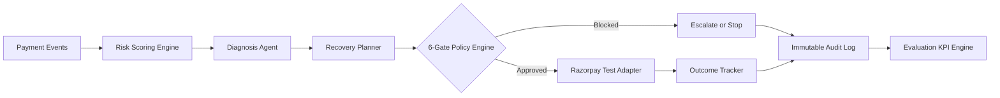

# Architecture

ReviveAI follows a controlled AI architecture for financial workflows.

```text
Payment Events
  -> Risk Scoring Engine (ML + Heuristic)
  -> Contextual Diagnosis Agent
  -> Recovery Planner (Channel & Action Sequencer)
  -> 6-Gate Policy Engine
  -> Razorpay Test Adapter
  -> Outcome Tracker
  -> Immutable Audit Log & Evaluation
```



## Core Design Principle

> **"The AI recommends. The policy engine controls."**

Financial workflows cannot afford uncontrolled generative model execution. ReviveAI ensures that no financial action is initiated without passing through strict, deterministic policy gates.

---

## Component Deep Dive

### 1. Risk Scoring Engine (`risk_engine.py` & `ml_model.py`)
- **Interpretable Scorer**: Computes recovery likelihood based on customer loyalty history, failure type characteristics, payment amounts, recency, and subscription flags.
- **Trainable Logistic Regression**: Zero-dependency pure-Python binary classifier trained on synthetic event histories with feature vectorization, threshold tuning on validation data, and held-out test benchmarking (`F1: 0.586`).

### 2. Contextual Diagnosis Agent (`diagnosis_agent.py`)
- Maps payment failure context, customer loyalty history, and failure taxonomy into dynamic, explainable root-cause statements.
- Prescribes high-fidelity recovery actions and specifies recovery channels (`auto_retry`, `sms`, `email`, or `none`).

### 3. Recovery Planner (`diagnosis_agent.py`)
- Translates diagnosis recommendations into executable workflows with configured delay windows, max retry limits, and recovery channel metadata.

### 4. 6-Gate Deterministic Policy Engine (`policy_engine.py`)
Enforces mandatory guardrails prior to any gateway execution:
1. **Consent Gate**: Customer opt-out strictly halts automated outreach.
2. **Action Escalation Gate**: Low recovery scores route directly to human operators.
3. **Amount Cap Gate**: Automatic interventions capped at INR 10,000 to prevent runaway high-ticket risks.
4. **Retry Budget Gate**: Hard cap of 2 retry attempts per payment event.
5. **Cooldown Window Gate**: Mandatory 30-minute minimum delay between retries to allow banking rails to settle.
6. **Idempotency Gate**: Already-captured or recovered payments are strictly blocked from duplicate execution.

### 5. Razorpay Test Adapter (`razorpay_adapter.py`)
- Provides deterministic simulation of Razorpay payment capture and payment link generation (`https://rzp.io/test/...`).
- Simulates realistic 504 gateway timeout scenarios (`DEMO_FAIL7`) to verify error handling without crashing or looping.

### 6. Thread-Safe Repository & Audit Index (`store.py`)
- In-memory event repository protected by `threading.RLock` to eliminate race conditions under concurrent requests.
- O(1) indexed audit event lookups per payment ID for responsive frontend timelines.

### 7. Immutable Audit Trail (`models.py`)
- Structured UTC-timestamped JSON audit log capturing every ingestion, policy evaluation, gateway execution, provider failure, and recovery.
