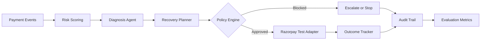

# Architecture

ReviveAI follows a controlled AI architecture for financial workflows.

```text
Payment Events
  -> Risk Scoring Engine
  -> Diagnosis Agent
  -> Recovery Planner
  -> Policy Engine
  -> Razorpay Test Adapter
  -> Outcome Tracker
  -> Audit and Evaluation
```



## Design Principle

The AI recommends. The policy engine controls.

The system deliberately avoids giving an LLM direct authority to execute money actions. Every action must pass deterministic checks for amount, consent, retry budget, cooldown, and current payment state.

## Components

### Risk Scoring Engine

`backend/app/risk_engine.py` estimates whether a failed payment is worth intervention using stable interpretable signals. `backend/app/ml_model.py` adds a trainable logistic model so the project has a real train/validation/test loop without adding heavy dependencies.

- failure type
- previous successful payments
- previous failures
- amount
- recency
- subscription status
- checkout abandonment

The dashboard uses the interpretable scorer for explainability. The evaluation report compares it with the trained model artifact.

### Diagnosis Agent

`backend/app/diagnosis_agent.py` maps payment context into a root cause and recovery recommendation. In a production version, this layer can call an LLM with structured output. The current build keeps it deterministic so reviewers can run it without API keys.

### Recovery Planner

The planner converts diagnosis into an explicit workflow:

- retry payment after cooldown
- send payment recovery link
- escalate to human review

### Policy Engine

`backend/app/policy_engine.py` gates all actions:

- max automatic amount: INR 10,000
- max retries: 2
- retry cooldown: 30 minutes
- customer opt-out blocks action
- recovered payments cannot be retried

### Razorpay Adapter

`backend/app/razorpay_adapter.py` currently uses a Razorpay-compatible test simulator. The adapter boundary is intentionally small so it can be replaced with real Razorpay test-mode calls while keeping policy gates unchanged.

### Audit Trail

Every important state transition is recorded:

- payment ingested
- policy evaluated
- action blocked
- Razorpay action attempted
- provider failure escalated
- revenue recovered
- recovery failed and escalated

## Failure Handling

Provider failures do not trigger unlimited retries. The workflow records the failure, preserves retry budget when appropriate, and escalates for human review.
